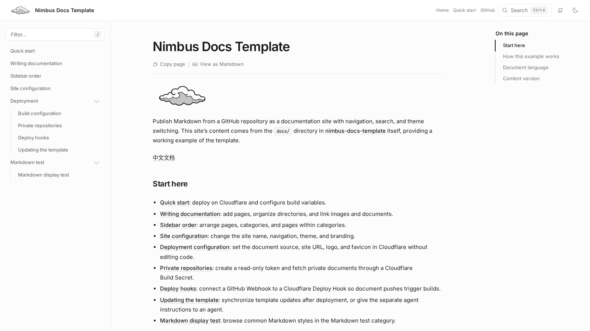

# Nimbus Docs Template

<!-- deploy-button:start -->
[](https://deploy.workers.cloudflare.com/?url=https://github.com/Azincc/nimbus-docs-template)
<!-- deploy-button:end -->

[中文说明](README.zh-CN.md) · [Live preview](https://nimbus.az1n.com)

<!-- dash-content-start -->

Publish Markdown from a GitHub repository as a documentation site on Cloudflare Workers. Keep documentation in its existing repository; each build fetches the configured branch and generates a static site with Nimbus and Astro.

- Public and private GitHub document sources.
- Automatic sidebar, table of contents, full-text search, and Markdown views.
- Light and dark themes, custom branding, navigation, and SEO settings.
- Plain Markdown input; no MDX or repository scripts are executed during the build.
- Document commit tracking in the footer and build metadata.

Built with Nimbus, Astro, Tailwind CSS, and Workers Static Assets.

<!-- dash-content-end -->



## Deploy

1. Click **Deploy to Cloudflare** to create a template repository and Worker.
2. Use `pnpm run build` as the build command and `pnpm run deploy` as the deploy command. Set the root directory to the template directory.
3. In **Settings → Builds → Variables and secrets**, add the build variables you want to change.
4. Save, then select **Retry build** in the build history. Open the resulting `workers.dev` address.

The first deployment uses this repository's [example docs](docs/README.md). Copying the template does not change `DOCS_REPO`; set it to publish your own documentation. Variables remain editable and take effect on the next build.

### Build variables

All variables are optional. Unset values use the defaults below. Enter names and values separately, without quotes.

| Variable | Default | Purpose |
| --- | --- | --- |
| `DOCS_REPO` | `https://github.com/Azincc/nimbus-docs-template.git` | GitHub HTTPS URL of the document repository |
| `DOCS_BRANCH` | `main` | Source branch |
| `DOCS_PATH` | `docs` | Document directory, relative to the source repository root |
| `DOCS_CONFIG_PATH` | `docs/site.json` | Site configuration path; set an empty value if there is no configuration file |
| `SITE_URL` | `https://nimbus.az1n.com` | Your public site URL; set an empty value until known |
| `SITE_LOGO` | `default` | HTTP(S) image URL or path relative to the source repository root |
| `SITE_FAVICON` | `default` | HTTP(S) image URL or path relative to the source repository root |

Omitting a variable inherits its default. For `SITE_URL` and `DOCS_CONFIG_PATH`, clear the field to override the default with an empty value; do not enter `""`. Use **Builds** variables: runtime **Variables & Secrets** are not automatically available during static builds.

`SITE_URL` controls SEO metadata, not domain binding. An empty value disables origin-dependent canonical URLs and the sitemap.

`SITE_LOGO` and `SITE_FAVICON` use `default` to inherit the corresponding site JSON image, falling back to the built-in official Nimbus logo (`/nimbus-logo.svg`) if that field is absent. Enter `default` when Cloudflare requires a nonempty value. Empty values behave the same way; an explicit image URL or repository path overrides JSON.

Before using `default` in an older deployment, [update the template](docs/deployment/template-update.md), including its build scripts and `public/nimbus-logo.svg`.

For a **private source repository**, add `DOCS_TOKEN` in the same **Builds → Variables and secrets** section, with type **Secret**. Use a GitHub token restricted to the source repository with **Contents: Read-only** permission. The token is used only for Git fetch; never put it in a repository file, URL, or ordinary variable. **The resulting website is public even when its source repository is private.** See the [private repository guide](docs/deployment/private-repository.md).

Pushes trigger builds when the documents and template share the connected repository and branch. For a separate source repository, connect a [Cloudflare Deploy Hook](docs/deployment/deploy-hook.md).

## Local development

Requires Git, Node.js **22.12.0 or later**, and **pnpm 10.2.0**.

```sh
git clone https://github.com/Azincc/nimbus-docs-template.git
cd nimbus-docs-template
pnpm install --frozen-lockfile
pnpm dev
```

Alternatively, run `npm ci` and `npm run dev`. Use `npm run <script>` for the other commands below.

Both development and production builds fetch the configured remote repository and require network access. To preview changes to local `docs/`, first push them to the configured source branch, then restart the command.

```sh
pnpm build
pnpm preview:cf
```

After reviewing the build, run `pnpm run deploy` to publish it with your Cloudflare credentials. The deploy script requires a successful build and rejects changed build artifacts.

| Command | Purpose |
| --- | --- |
| `pnpm build` | Build static pages and the search index |
| `pnpm preview:cf` | Preview built assets in the local Workers runtime |
| `pnpm run deploy` | Deploy previously built assets |
| `pnpm config:probe` | Inspect build settings and their sources |
| `pnpm test` | Run core tests |
| `pnpm check` | Check Astro and TypeScript after a build (`typecheck` is an alias) |
| `pnpm e2e:dev --port 8787` | Serve a completed build for browser tests |

## Documentation

English is the default. Start with the [quick start](docs/getting-started.md) or [configuration reference](docs/site-config.md). The complete [Chinese edition](docs-zh-CN/README.md) is also included.

To publish the Chinese edition, set both build variables, then rebuild:

| Variable | Value |
| --- | --- |
| `DOCS_PATH` | `docs-zh-CN` |
| `DOCS_CONFIG_PATH` | `docs-zh-CN/site.json` |

Each build publishes one language. `locale` sets the HTML language; it does not translate pages or add a language switcher.

## Project

- The document root's `README.md` or `index.md` becomes `/`. If neither exists, the build generates an index.
- `docs/` and `docs-zh-CN/` contain English and Chinese example documents; `src/` contains the site UI; `scripts/` handles source fetching, conversion, building, and deployment.
- `src/content/docs/`, `public/_source/`, and `dist/` are generated. Maintain documents in the source repository.
- The footer and `/_build.json` record the document commit used by each build.
- Run `node scripts/configure-template.mjs <repository HTTPS URL>` to update deployment buttons after moving the template.

Licensed under [MIT](LICENSE). See [NOTICE.md](NOTICE.md) for upstream attribution.
